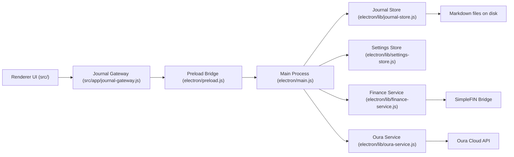

# Billbook

Billbook is a local-first Electron journal for writing every day.
Each journal entry is stored as a real Markdown file in a folder you choose outside this repo.

## What You Are Looking At

Billbook is split into three layers:

1. `electron/`
   The desktop side of the app. This layer owns windows, dialogs, filesystem access, file watching, and app lifecycle.
2. `electron/preload.js`
   The safe bridge between Electron and the browser UI.
3. `src/`
   The frontend window that renders the journal UI and handles user interactions.

If you are new to Electron, the important idea is:

- the `main process` is the desktop app supervisor
- the `renderer` is basically the app UI running in a browser window
- the `preload` script is the narrow bridge between them

## Billbook Architecture



## Folder Guide

- `electron/main.js`
  App lifecycle, IPC handlers, native dialogs, dirty-close flow, folder watching.
- `electron/preload.js`
  Exposes the small `window.journalApp` API to the renderer.
- `electron/lib/journal-store.js`
  Pure filesystem and Markdown persistence logic.
- `electron/lib/settings-store.js`
  Stores Billbook app settings like the selected journal directory.
- `electron/lib/finance-service.js`
  Claims SimpleFIN setup tokens, fetches finance data, and builds the `Finances` snapshot text for new entries.
- `electron/lib/oura-service.js`
  Runs the Oura OAuth flow, refreshes Oura tokens, and builds the `Sleep` snapshot text for new entries.
- `src/renderer.js`
  The renderer entrypoint. It wires the Electron bridge to the app controller.
- `src/app/app-controller.js`
  The main frontend workflow/controller layer.
- `src/app/journal-gateway.js`
  Adapter over the preload API. This keeps the controller unaware of Electron details.
- `src/app/render.js`
  UI rendering for the main editor chrome and top-level states.
- `src/app/sidebar.js`
  Sidebar DOM rendering.
- `src/app/entry-tree.js`
  Pure data shaping for the year -> month -> week sidebar structure.
- `src/app/state.js`
  Initial app state.
- `src/app/view-state.js`
  Derived editor screen modes like `no-folder`, `missing-folder`, and `editor`.
- `src/app/utils.js`
  Shared pure helpers for dates, snapshots, and labels.
- `src/styles.css`
  All UI styling.

For more detail:

- [electron/README.md](./electron/README.md)
- [src/app/README.md](./src/app/README.md)

## Separation Of Concerns

The current rule of thumb is:

- if code touches Electron, dialogs, filesystem APIs, or app windows, it belongs in `electron/`
- if code talks to `window.journalApp`, it should live in `src/app/journal-gateway.js`
- if code is pure app logic or data transformation, it belongs in `src/app/*.js`
- if code creates or updates DOM nodes, it belongs in `render.js`, `sidebar.js`, or `dom.js`

That separation is intentional. It makes the renderer easier to reason about and keeps Billbook's business logic less coupled to Electron.

## How A Save Works

When you press `Command-S`, this is roughly what happens:

1. The renderer controller gathers the current `date`, `title`, and the seven journal sections.
2. The renderer calls the journal gateway.
3. The gateway forwards that request through the preload bridge.
4. The Electron main process receives the IPC request.
5. `electron/lib/journal-store.js` writes the Markdown file to disk.
6. The saved entry comes back through the same path to the renderer.
7. The renderer updates UI state and clears the dirty flag.

## Journal Storage

Billbook stores journal entries outside this repo.
When you open the app, choose any folder you want to use as your journal directory.

Each entry is saved as a Markdown file with a name like:

```text
2026-04-18-a1b2c3d4.md
```

The file contains simple frontmatter and a fixed Markdown prompt structure:

```md
---
title: "Evening Reflection"
date: "2026-04-18"
createdAt: "2026-04-18T23:10:00.000Z"
updatedAt: "2026-04-18T23:18:00.000Z"
---

## Feelings

Calm, a little tired, still focused.

## Moments

Started shaping a better daily writing routine.

## Predictions

Tomorrow will feel easier if I keep the entry short.

## News

Did not read much today.

## Happiness

A walk and a quiet dinner.

## Finances

Net Worth
$1,245.18
As of April 18, 2026

Chase Freedom
- Coffee shop — $5.80
Total: $5.80

## Sleep

Duration: 7 hrs 42 mins
```

## Local Development

```bash
cd /path/to/billbook
npm install
npm start
```

## Build A macOS App

```bash
cd /path/to/billbook
npm install
npm run build:mac
```

This creates:

```text
dist/mac-arm64/Billbook.app
```

## Install Into Applications

After building:

```bash
npm run install:mac
```

That copies the app into:

```text
~/Applications/Billbook.app
```

## Full Setup On Another Mac

```bash
git clone https://github.com/liuwilliam424/billbook.git
cd billbook
npm install
npm run setup:mac
```

## Current Constraints

- macOS only for now
- local files are the source of truth
- app is ad-hoc signed, not notarized
- still uses the default Electron icon
